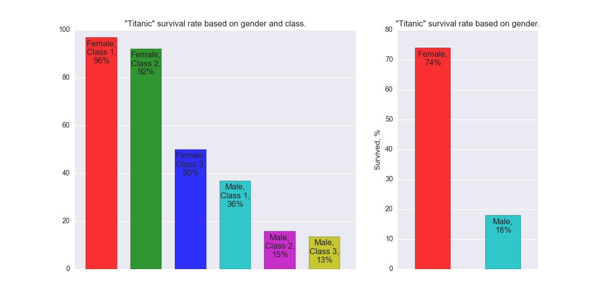

### Udacity /  Data Analyst Nanodegree 08'2016
### P2: Investigate a Dataset

### ASSIGNMENT:
Choose one of Udacity's curated datasets and investigate it using NumPy and Pandas. Go through the entire data analysis process, starting by posing a question and finishing by sharing your findings.

### TO USE:
Clone project or download project's zip folder to your computer.
Open titanic.py file in your favorite code editor and run to produce the graphs.

### DATA SET:
titanic_data.csv

### ANALYZING DATA:
One of the reasons that the shipwreck led to such loss of life was that there were not enough lifeboats for the passengers and crew. Although there was some element of luck involved in surviving the sinking, some groups of people were more likely to survive than others, such as women, children, and the upper-class. (https://www.kaggle.com/c/titanic)

My task was to explore the survival rates of men and women overall and based on their traveling class or how the rates correlated with passenger location on the ship. In particular I wanted to compare survival rates of the first class males and third class females. 

### CONCLUSION:
Based on the data sample, the overall survival rate for men was 18%, for women it was 74%.  The survival rate for men traveling first class was just 2/3 of the survival rate for women traveling third class. It was indeed "women first".

